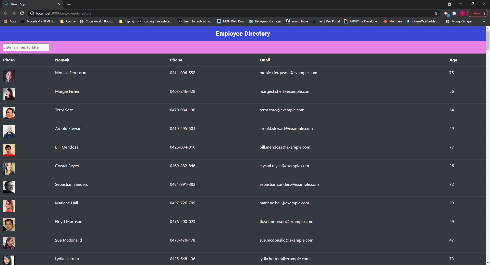

# Employee-Directory

- [Deployed GitHub Pages Link](https://fraserclarke.github.io/Employee-Directory/)

> ## Description

A Employee-directory web application which enables the user to filter and sort through a list of employees with non sensitive information.
The employees are generated using [Random User API](https://randomuser.me/).
This application uses React and is deployed using GitHub Pages.

## Table of contents

- [Description](#Description)
- [Links](#Links)
- [General info](#general-info)
- [Screenshots](#Screenshots)
- [Questions](#Questions)
- [Credits](#Credits)

## Screenshots

<!--  -->

## General info

#### User Story

- As a user, I want to be able to view my entire employee directory at once so that I have quick access to their information.

#### Business Context

An employee or manager would benefit greatly from being able to view non-sensitive data about other employees. It would be particularly helpful to be able to filter employees by name.

#### Acceptance Criteria

Given a table of random users generated from the [Random User API](https://randomuser.me/), when the user loads the page, a table of employees should render.

The user should be able to:

- Sort the table by at least one category

- Filter the users by at least one property.

## Questions

- GitHub username: FraserClarke
- [Github Link](https://github.com/FraserClarke)
- Email Address: clarkefraser1@gmail.com

## Links

- [Github Repository](https://github.com/FraserClarke/Employee-Directory)

- [Deployed GitHub Pages Link](https://fraserclarke.github.io/Employee-Directory/)

## Credits

- Created by: [Fraser Clarke](https://github.com/FraserClarke)
- This project was bootstrapped with [Create React App](https://github.com/facebook/create-react-app).
